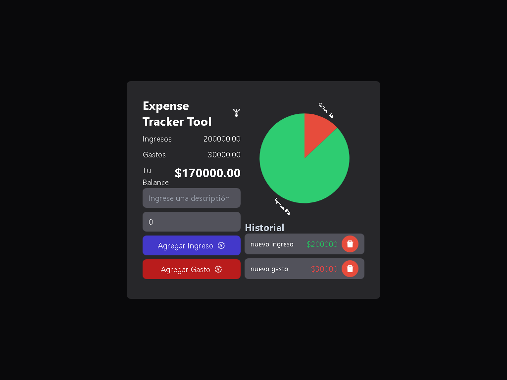

# Expense Tracker

## Descripción

Código base de la aplicación Expense Tracker Hecha en React.js y Tailwind CSS.

---

## Vista En Versión Desktop

## Vista En Versión Mobile

---

## Enlace A La Aplicación

- [Expense Tracker](https://axe10rellana-expense-tracker.netlify.app/)

---

## Hecho con

- [React](https://react.dev/) - JS library
- [Tailwind CSS](https://tailwindcss.com/) - For Styles

---

## Comandos

- npm i
- npm run dev
- npm run build

---

## Dependencias

- React
- React Victory

---

## Dependencias De Desarrollo

- Autoprefixer
- Post CSS
- Tailwind CSS
- Vite

---

## Autor

- Website - [Axe10rellana](https://axe10rellana.github.io/portafolio/portafolio/)
