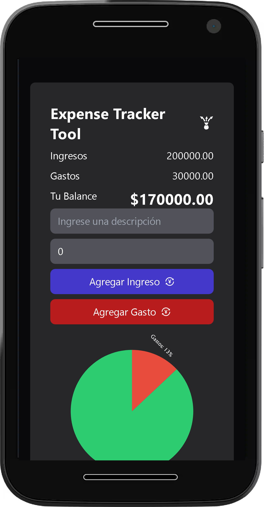

# Expense Tracker Tool

## Descripción

Código base de la aplicación Expense Tracker Tool Hecha en React.js y Tailwind CSS.

---

## Vista En Versión Desktop

## Vista En Versión Mobile

---

## Enlace A La Aplicación

- [Expense Tracker](https://expense-tracker-tool.netlify.app/)

---

## Hecho con

- [Hello Pangea DND](https://github.com/hello-pangea/dnd) - For Drag And Drop
- [React](https://react.dev/) - JS Library
- [React Victory](https://commerce.nearform.com/open-source/victory/) - For Charting And Data Visualization
- [React Icons](https://react-icons.github.io/react-icons/) - For Icons
- [Tailwind CSS](https://tailwindcss.com/) - For Styles
- [SweetAlert2](https://sweetalert2.github.io/) - For Alerts

---

## Comandos

- npm i
- npm run dev
- npm run build

---

## Dependencias

- @hello-pangea/dnd
- React
- React Icons
- React Victory
- Sweetalert2

---

## Dependencias De Desarrollo

- Autoprefixer
- Post CSS
- Tailwind CSS
- Vite

---

## Autor

- Website - [Axe10rellana](https://axe10rellana.github.io/portafolio/portafolio/)
